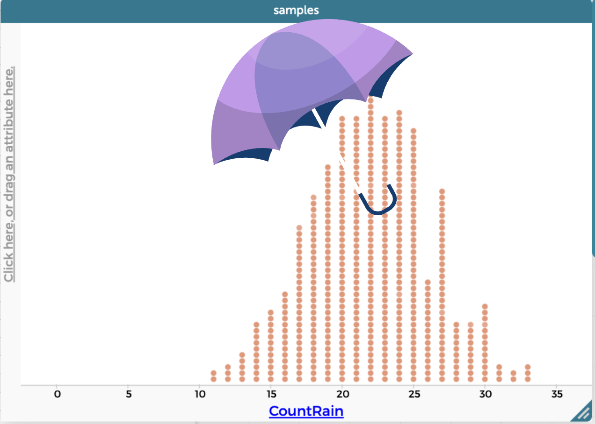

<br />

## Session Description

Experience activities to build students’ reasoning about sampling distributions, variability, and statistical inference via simulation methods (part of the revised MN math standards). Participants will also explore CODAP—a free, user-friendly data analysis tool. Resources will be provided for classroom implementation. 


<br />

## Slides

```{=html}
<iframe src="https://docs.google.com/presentation/d/e/2PACX-1vTCbUrZWQj6-ydiLsSi5JaItxMxYjaRHvjdwh6zEsCF6i86ufsBv5RZv_7EDr2qrj9S9og3yKxasjp5/pubembed?start=false&loop=false&delayms=3000" frameborder="0" width="720" height="426.753" allowfullscreen="true" mozallowfullscreen="true" webkitallowfullscreen="true"></iframe>
```

[Download slides here](files/mctm26-simulation/simulation-slides.pdf) <br />

<br />

## Link to Activity

[Rainfall Activity](files/mctm26-simulation/rainfall-activity.pdf)